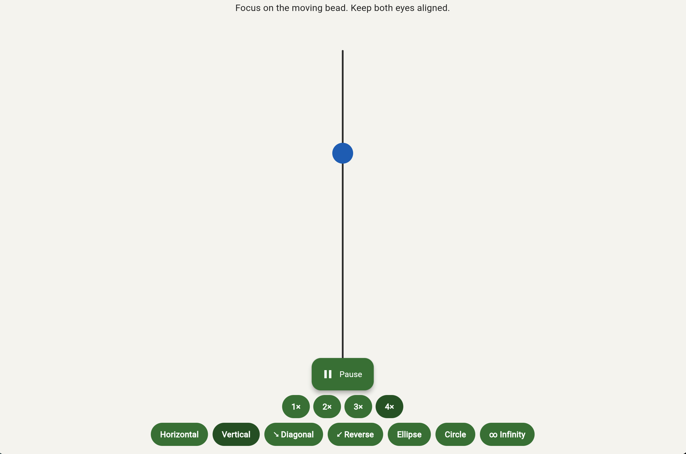
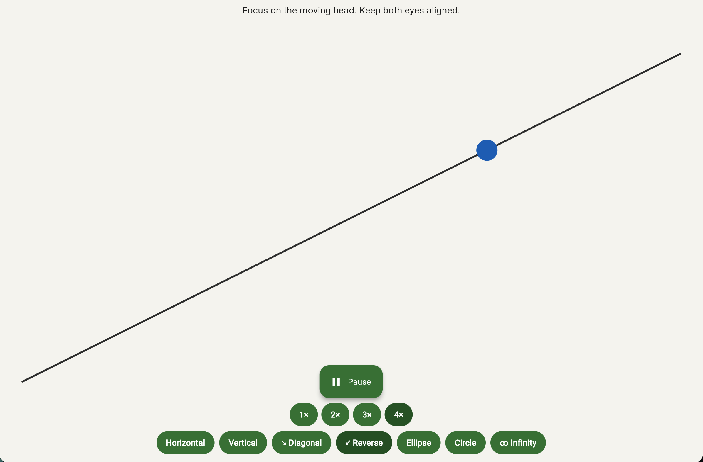
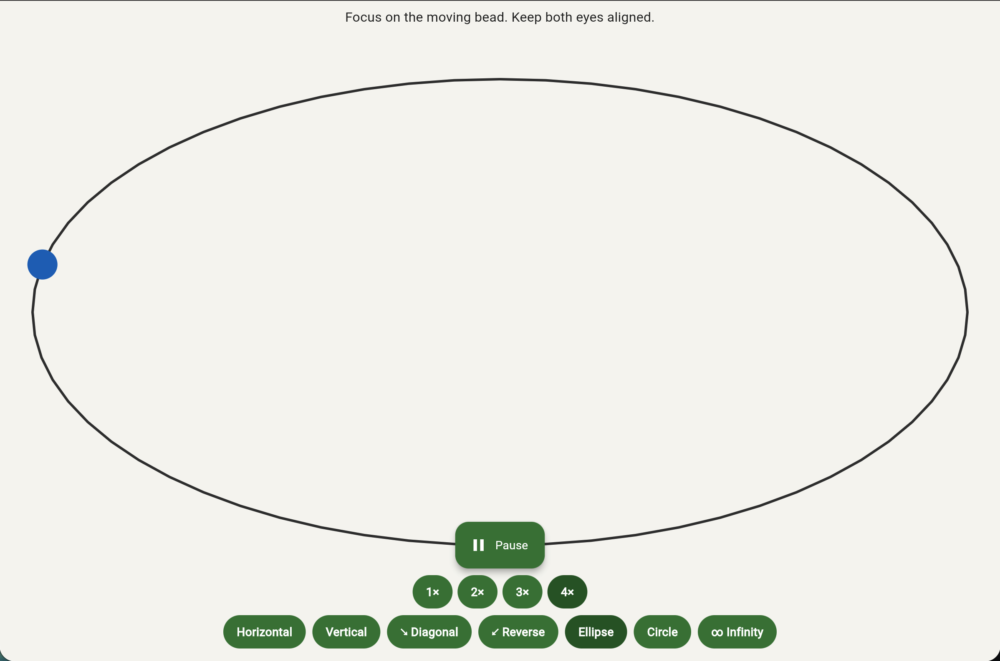
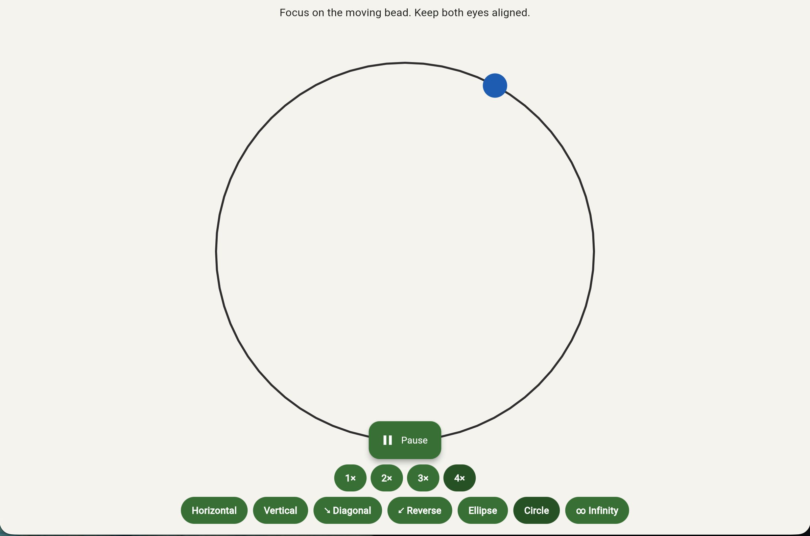
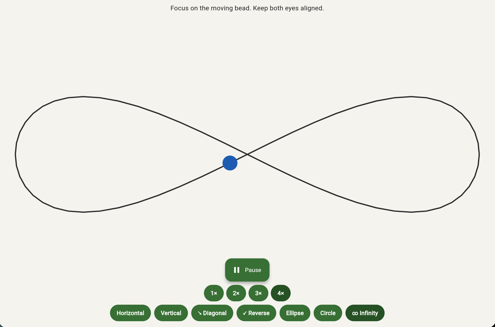

# Vision Exercise

A Flutter app for **Brock String** vision therapy exercises. Designed for strabismus users to practice convergence by following a moving bead along a string.

## Features

- **Horizontal mode** — Bead moves left–right along a horizontal string
- **Vertical mode** — Bead moves up–down along a vertical string
- **Diagonal modes** — ↘ Top-left to bottom-right, ↙ Top-right to bottom-left
- **Ellipse** — Bead traces an oval path
- **Circle** — Bead traces a circular path
- **Infinity** — Bead traces a figure-8 (lemniscate) path
- **Speed control** — 1×, 2×, 3×, 4× for different difficulty levels
- **Start/Pause** — Control the bead animation
- **Web support** — On Chrome/web: no rotate prompt, exercise runs in any orientation
- **Mobile** — Splash screen, then landscape orientation for the exercise on phones/tablets

## Movement Modes

| Vertical | Diagonal ↙ | Diagonal ↘ |
|:--------:|:----------:|:----------:|
|  |  |  |

| Ellipse | Circle | Infinity |
|:-------:|:------:|:--------:|
|  |  |  |

## Getting Started

### Prerequisites

- [Flutter](https://docs.flutter.dev/get-started/install) SDK

### Run the app

```bash
# Mobile (iOS/Android)
flutter run

# Web (Chrome)
flutter run -d chrome

# macOS
flutter run -d macos
```

### Run tests

```bash
flutter test
```

## Project structure

- `lib/main.dart` — App entry, routes to splash or exercise on web
- `lib/splash_screen.dart` — Bounce animation, then “rotate to landscape” (mobile only)
- `lib/exercise_screen.dart` — Brock String exercise with speed and direction controls
- `lib/brock_string_painter.dart` — Custom painter for string and moving bead

## License

MIT
